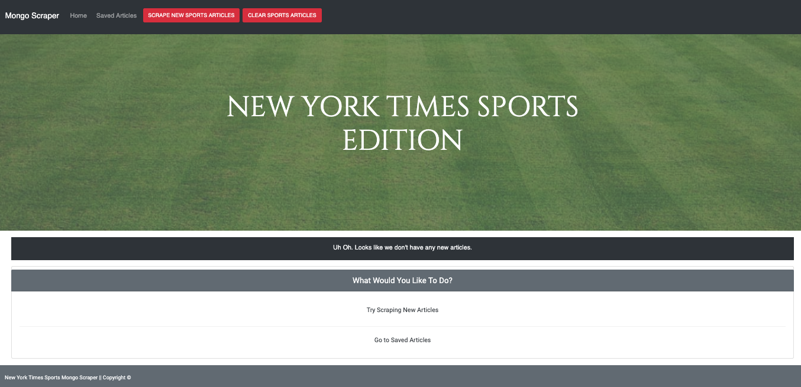
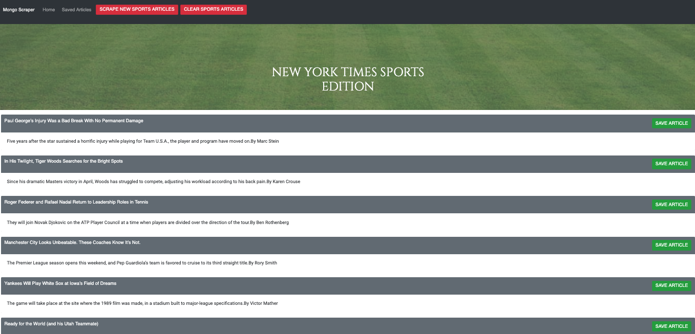
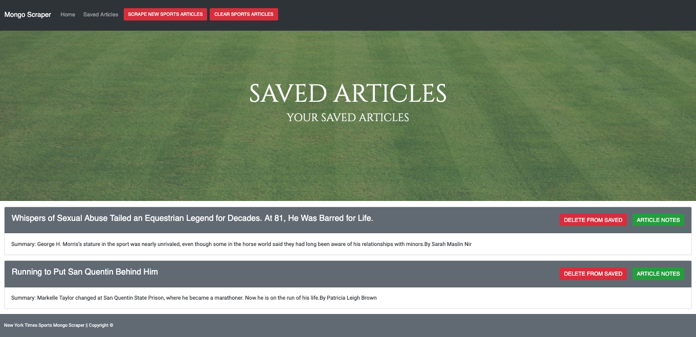

# All-the-News-Thats-Fit-to-Scrape

In this assignment, you'll create a web app that lets users view and leave comments on the latest news. But you're not going to actually write any articles; instead, you'll flex your Mongoose and Cheerio muscles to scrape news from another site.

Technologies used: JavaScript, MongoDB

npm packages used: express express-handlebars mongoose body-parser cheerio request axios

# Home Page

# News Scraped

# Saved Page

# Demo
The demo of the burger eating application can be found <a href="https://evening-plains-55657.herokuapp.com/burgers">Here on Heroku.</a>.
